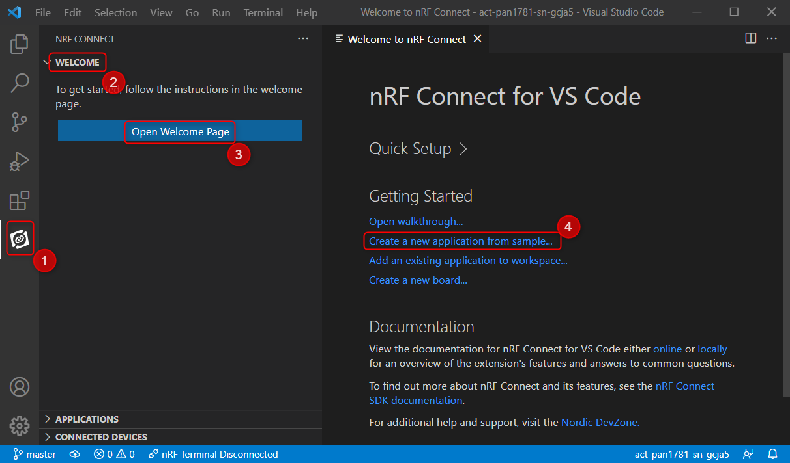
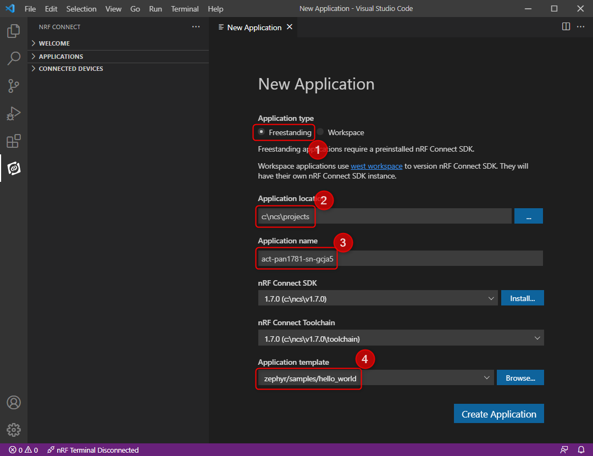
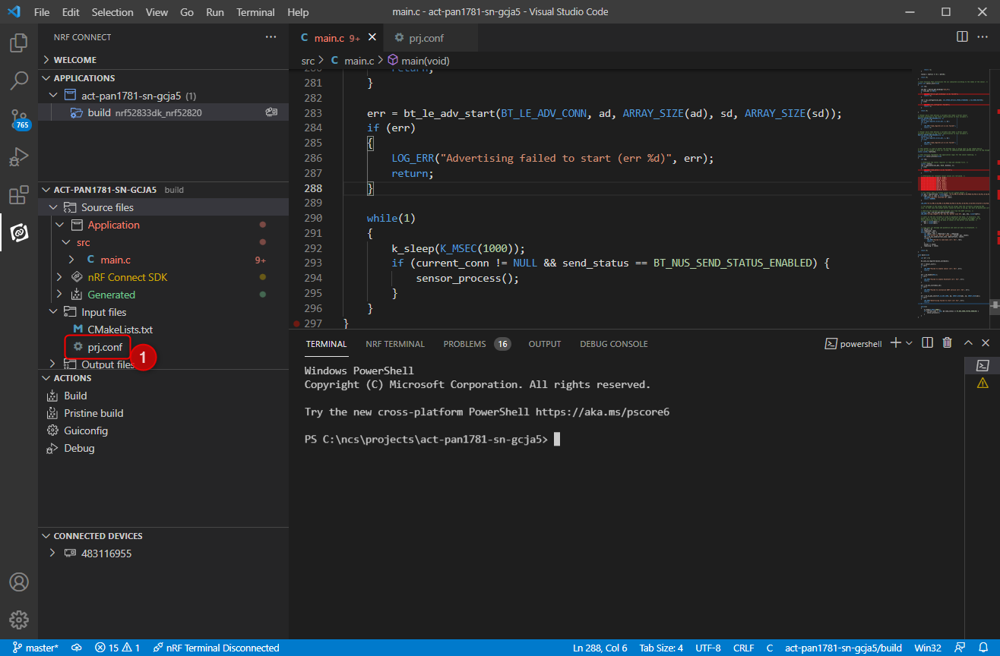
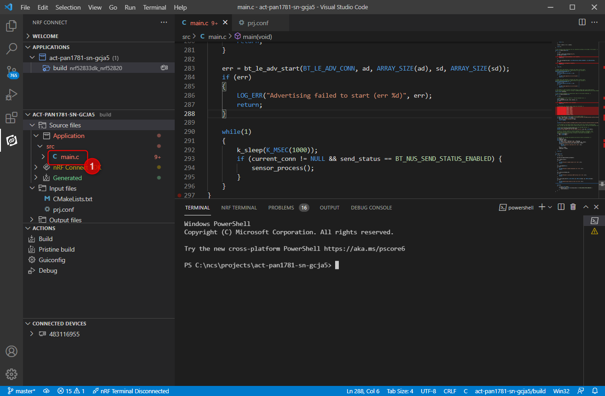

# Table of Contents <!-- omit in toc -->

- [Introduction](#introduction)
- [Project Initialization from Scratch](#project-initialization-from-scratch)
- [Adaptations](#adaptations)
  - [Project Configuration](#project-configuration)
    - [Bluetooth](#bluetooth)
    - [Nordic UART Service](#nordic-uart-service)
    - [Logging](#logging)
    - [I2C](#i2c)
  - [Main Code](#main-code)
    - [Bluetooth Handling](#bluetooth-handling)
    - [Sensor Handling](#sensor-handling)
    - [Main Function](#main-function)
- [Troubleshooting](#troubleshooting)
  - [Problems with Visual Studio Code](#problems-with-visual-studio-code)
    - [Build Output Does Not Show In Terminal Window](#build-output-does-not-show-in-terminal-window)
    - [Jumping To Compile Error Does Not Work](#jumping-to-compile-error-does-not-work)
    - [Debugging may not work](#debugging-may-not-work)
    - [F12 Does Not Work All The Way](#f12-does-not-work-all-the-way)
    - [Red Curvy Lines All Over The Place](#red-curvy-lines-all-over-the-place)

# Introduction

The purpose of this document is to explain the inner workings of this demo.

# Project Initialization from Scratch

If you want to recreate this demo from scratch, the following steps have to be done.

From the nRF Connect Extension (1) please select the "Welcome" section (2) and choose to "Open Welcome Page" (3).

Afterwards chosse "Create a new application from sample..." (4) .

The goal is to create a freestanding (1) application, which runs as part of the installed nRF Connect SDK.

Application location (2) and application name (2) can be freely chosen, for example "act-pan1781-sn-gcja5". All other settings are predefined and should already be set correctly.

The application template (4) must be set to the "hello_world" demo from the nRF Connect SDK - use the "Browse..." button to search for it.

Afterwards select "Create Application" to continue.

Now a build configuration has to be created as explained in the README.

# Adaptations

## Project Configuration

A couple of options are enabled and configured in prj.conf (1) in addition to the ones that are already set in the "hello world" example.

### Bluetooth

All options starting with CONFIG_BT enable general Bluetooth support and peripheral support  for the application. For personalization the device name and the appearance are set. Some Bluetooth-internal buffers are increased to support a larger MTU size for a more efficient data transfer.

### Nordic UART Service

The CONFIG_BT_NUS options enables support for the Nordic UART Service (NUS).

### Logging

Various options enable logging. The output of the logging is re-routed to the Segger J-Link RTT backend instead of the serial UART console. Also support for the console is enabled and re-routed to the Segger J-Link RTT backend. Assertions are enabled, so that run-time errors are caught easily.

### I2C

The CONFIG_I2C option enables general I2C support.

## Main Code

The code as present in main.c (1) can be divided into separate blocks.

### Bluetooth Handling

The code must keep track of the connection state and if the Nordic UART service is enabled, so appropriate callback functions are provided and the states are tracked in global variables.

### Sensor Handling

First a bunch of helper functions to access the registers of the sensor are provided, followed by an init() function.

Afterwards the main sensor process function reads out all sensor values by using some helper macros, crafts a message that contains all sensor values in a human-readable form and finally sends them out using the Nordic UART service.

### Main Function

First the main function initializes the sensor, Bluetooth and Nordic UART subsystems.

After starting the advertising it goes into an endless loop and checks every second if a connection has been established and sending via the Nordic UART service is possible and if so, the sensor processing function is called to transfer sensor data to the connected device.

# Troubleshooting

## Problems with Visual Studio Code

### Build Output Does Not Show In Terminal Window

Sometimes the build output is only shown in the small window in the lower right corner, but the terminal windows is overlaid by some other terminal window. Solution: Close the other terminal windows.

### Jumping To Compile Error Does Not Work

Clicking on the error output does not open the offending code right away. Solution: press CTRL and click on the file name in the output.

### Debugging may not work

Debugging may not be working and the error "Failed to launch undefined GDB Server" is displayed. Solution: The root cause of the problem is that Segger J-Link in 32-bit version is expected by Nordic Connect Setup and if it is not available, produces this problem.

Please check out https://devzone.nordicsemi.com/f/nordic-q-a/80062/questions-for-visual-studio-code-at-sdk-connect-v1-7-0 for a discussion how to fix it.

### F12 Does Not Work All The Way

Pressing F12 only brings you to the function declaration, but not to the implementation. Full text search for a function does not reveal the location in the SDK. Currently no solution.

### Red Curvy Lines All Over The Place

Log function calls are getting flagged as erroneous. Currently no solution.