# Table of Contents <!-- omit in toc -->

- [Introduction](#introduction)
- [Hardware Setup](#hardware-setup)
- [Visual Studio Code + nRF Connect SDK Installation](#visual-studio-code--nrf-connect-sdk-installation)
- [Project Initialization](#project-initialization)
- [Build Configuration](#build-configuration)
- [Compilation, Flashing and Execution](#compilation-flashing-and-execution)
  - [Compilation](#compilation)
  - [Flashing](#flashing)
  - [Execution](#execution)
- [Usage](#usage)
- [Sensor Data Format](#sensor-data-format)

# Introduction

The goal of this project is to show the usage of the Panasonic SN-GCJA5 sensor in conjunction with the PAN1781 EVB.

The Panasonic SN-GCJA5 is a laser particulate matter (PM) sensor that can be used for measuring air quality. It can be accessed via I2C interface. 

https://na.industrial.panasonic.com/products/sensors/air-quality-gas-flow-sensors/lineup/laser-type-pm-sensor/series/123557/model/123559

The Panasonic PAN1781 EVB is the evaluation board for the PAN1781 module which is based on the nRF52820 Bluetooth chipset by Nordic Semiconductor.

https://industry.panasonic.eu/products/devices/wireless-connectivity/bluetooth-low-energy-modules/pan1781-nrf52820

The sensor data of the SN-GCJA5 is collected via I2C and is forwarded as cleartext to a remote device via Bluetooth using the Nordic UART Service (NUS).

The application is based on version v2.1.0 of the nRF Connect SDK by Nordic Semiconductor.

 https://developer.nordicsemi.com/nRF_Connect_SDK/doc/latest/nrf/getting_started.html

# Hardware Setup

Attach the SN-GCJA5 PM sensor to the PAN1781 EVB as shown in the following picture.

Also make sure to set the jumper on P17 as shown so that the 5V power supply pin is enabled correctly.

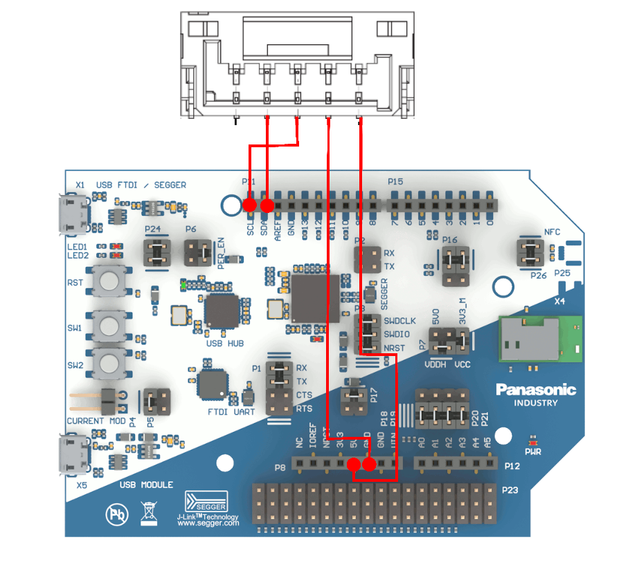

# Visual Studio Code + nRF Connect SDK Installation

Refer to the available online documentation from Nordic Semiconductor that explains how to get Visual Studio Code and nRF Connect SDK running.

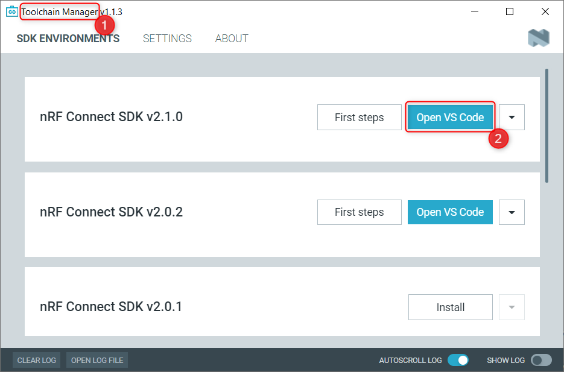

Make sure to use the "Toolchain Manager" (1) from the nRF Connect for Desktop application and use the "Open VS Code" option (2) to launch Visual Studio Code.

# Project Initialization

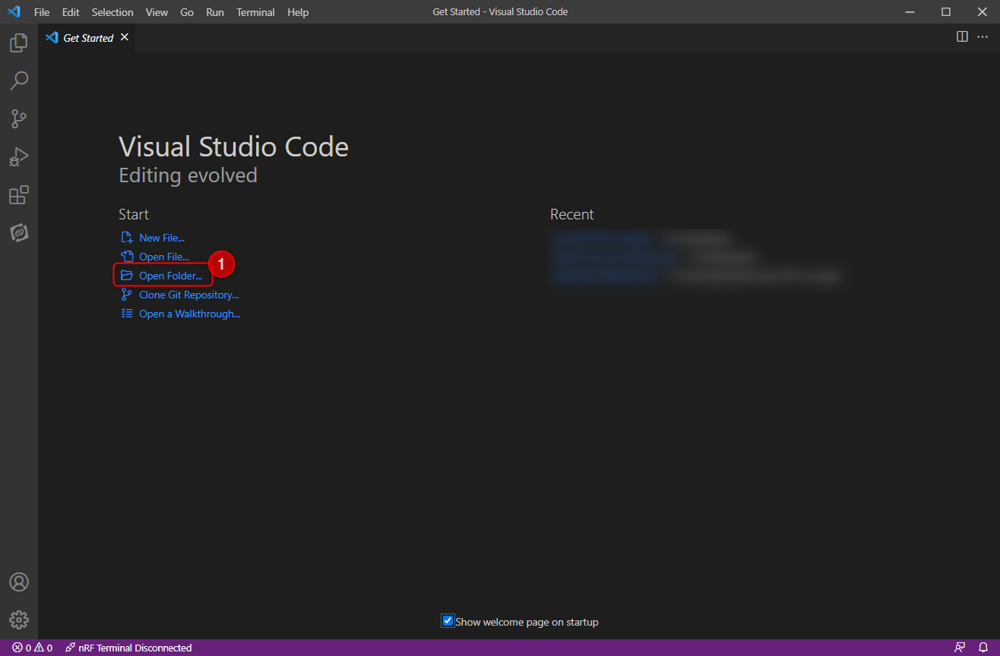

After cloning the Git repository use the "Open Folder" (1) option from the Visual Studio Code welcome screen and navigate to the folder with the Git repository.

Visual Studio Code (or more precisely: the nRF Connect for VS Code extension) will ask a couple of questions which have to be answered depending on the needs of the user. If in doubt, use the "Ask me later" option.

# Build Configuration

The project is not targeted towards a specific hardware after opening, so a specific build configuration must be created.

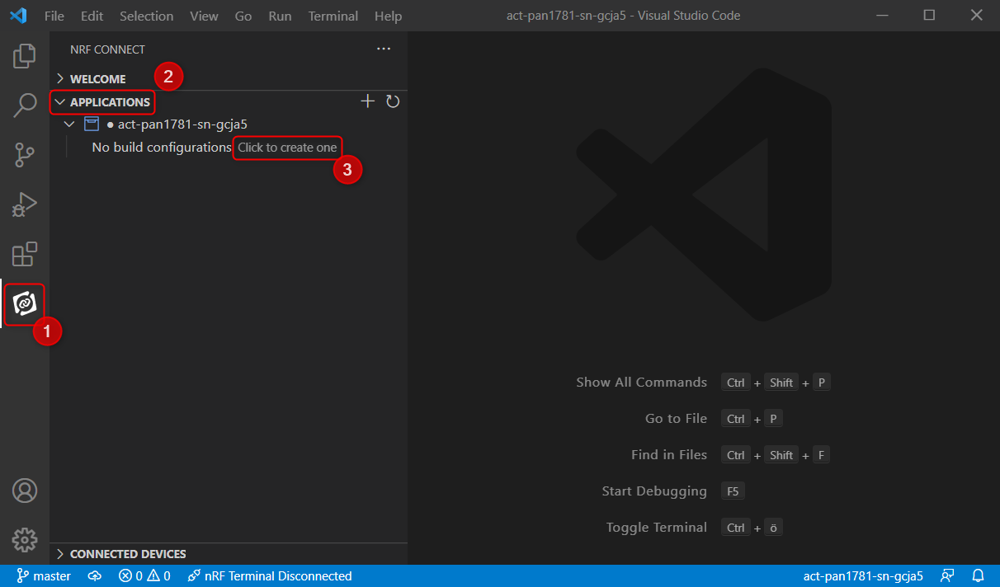

From the nRF Connect Extension (1) select the "Applications" section (2) and choose "Click to create one" (3) to add a new build configuration.

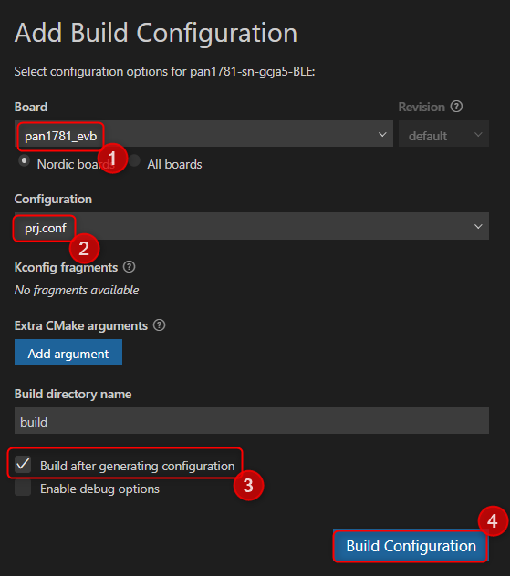

Choose the "pan1781_evb" (1) board configuration.

The "prj.conf" configuration (2) is the only configuration that is available for this project.

You may deselect the "Build after generating configuration" option (3), in case you want to further modify the project before building.

Afterwards click "Generate Config" (4). This may take a while.

# Compilation, Flashing and Execution

## Compilation

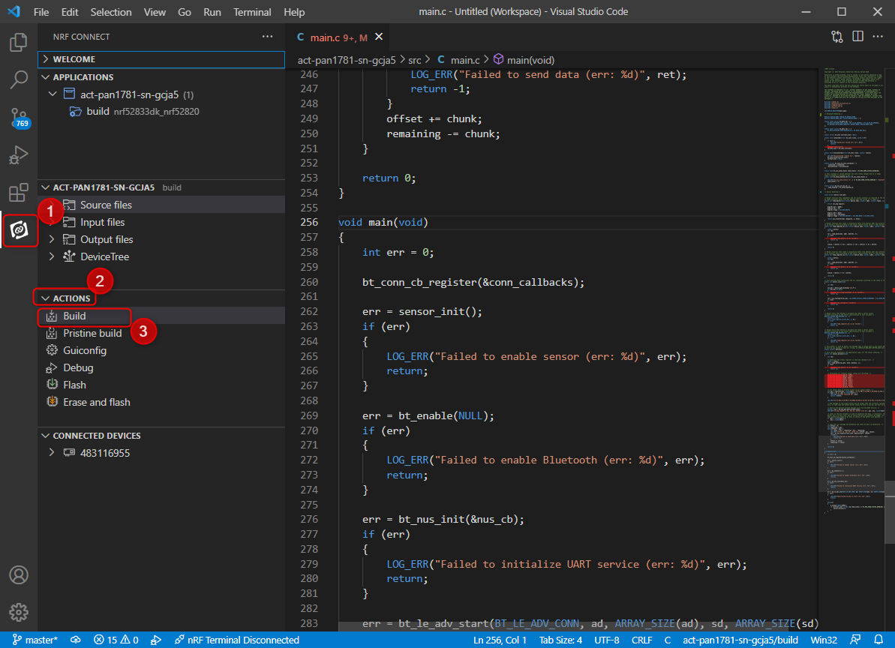

At any time, for example after changes have been made to the source code, from the nRF Connect Extension (1) select the "Actions" section (2) and choose "Build" (3) to compile the application.

## Flashing

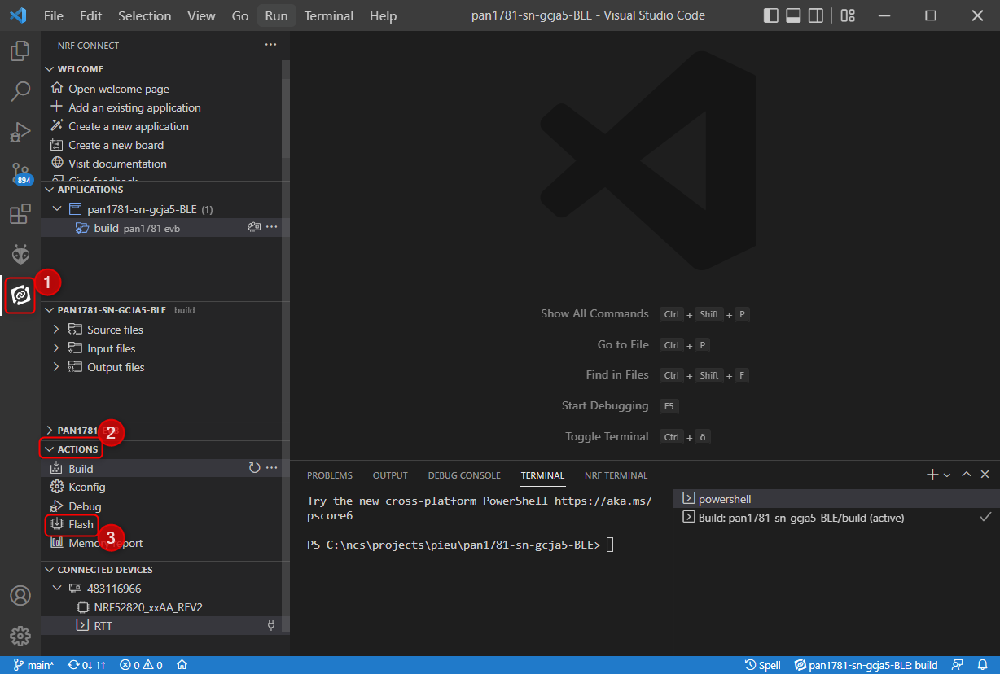

From the nRF Connect Extension (1) select the "Actions" section (2) and choose "Flash" (3) to flash the application to the evaluation board.

## Execution

Whenever the application is successfully flashed it is started automatically.

All debug and diagnostic messages are output to the Segger J-Link RTT console.

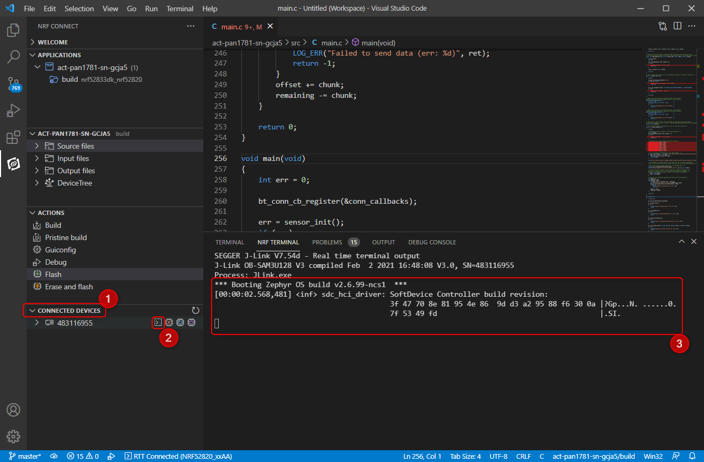

From the "Actions" section (1) choose your attached board and select the "Connect to RTT in nRF Terminal" option (2) to make the RTT window visible (3).

# Usage

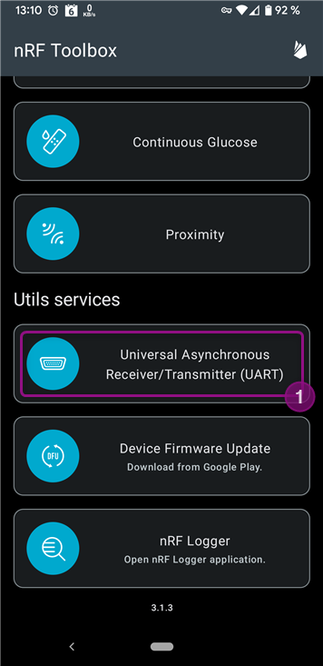

A suitable application has to be run on the remote device, for example the "UART" plugin of the "nRF Toolbox" app (1).

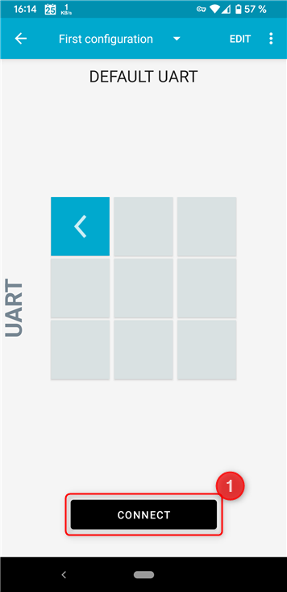
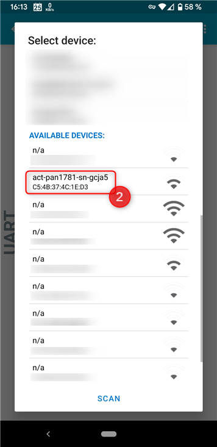

Use the "Connect" (1) button and choose the right peripheral device from the list of devices (2).

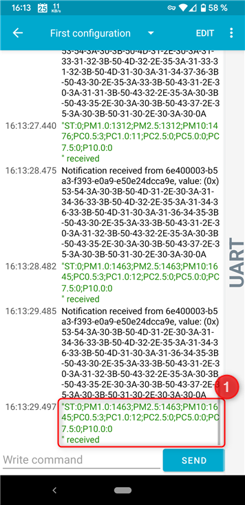

After the connection has been established, swipe left to make the log output visible where the sensor data are shown.

# Sensor Data Format

The sensor data is read from the sensor as-is and transferred in cleartext format. Different members of the sensor data are separated by a semicolon, while identifier and value are separated by a colon.

```
ST:41;PM1.0:0;PM2.5:181;PM10:203;PC0.5:0;PC1.0:1;PC2.5:2;PC5.0:0;PC7.5:0;P10.0:0
```

"ST" represents the status, "PM" the mass-density value and "PC" the particle count data.

For further information refer to the communication specification of the sensor.
